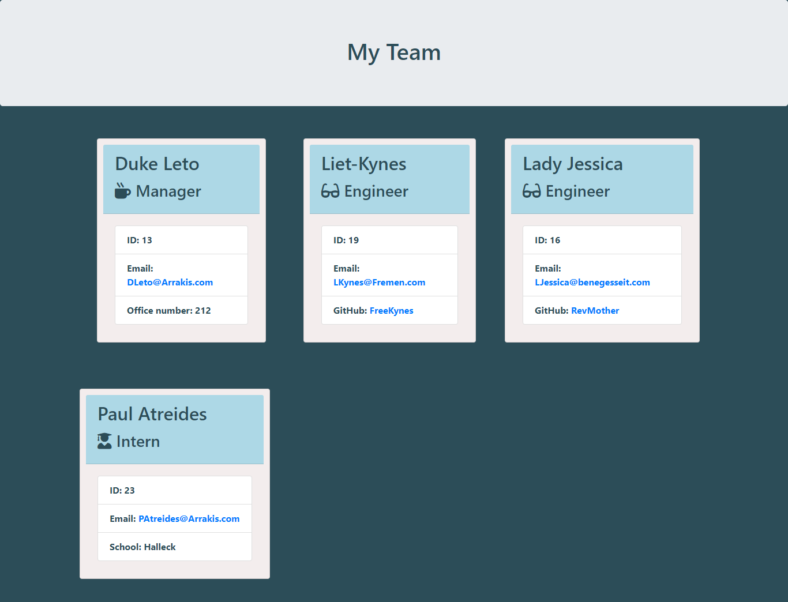
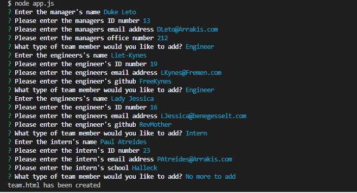
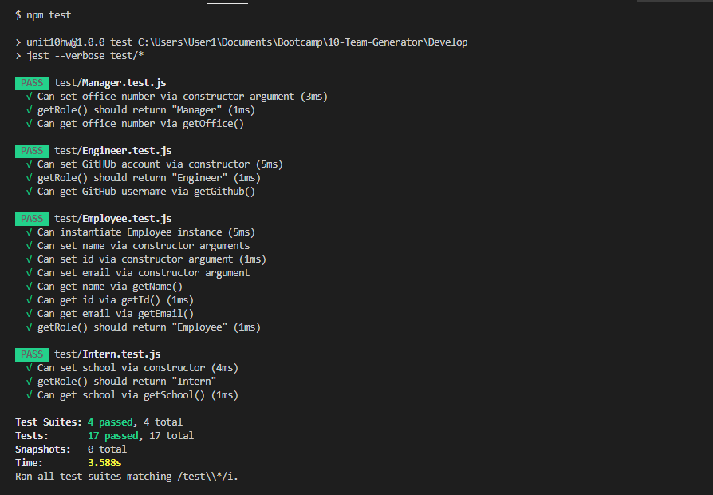

# Employee Roster Generator

## Description 
Generate an employee roster for any team that includes a manager, engineers and interns. Inputs are tailored to job position.

Link to deployed application with sample input:
https://litabeach.github.io/Team-Generator/Develop/output/team.html

## Table of Contents 

* [Installation](#installation)
* [Usage](#usage)
* [Credits](#credits)
* [License](#license)
* [Badges](#badges)
* [Tests](#tests)

## Installation

Run the following commands from the command line:
npm i inquirer
npm i jest
npm i path

Once the relevant packages have been installed, use the command "node app.js" from the command line to run the application.

## Usage 

Sse the command "node app.js" from the command line to run the application. Answer questions about the manager of the project. Add as many engineers and interns as needed. The application will render an html page based on your input once you have completed the series of questions.

## Credits

Blake Dragos

## License

Copyright 2020 Lita Beach

Permission is hereby granted, free of charge, to any person obtaining a copy of this software and associated documentation files (the "Software"), to deal in the Software without restriction, including without limitation the rights to use, copy, modify, merge, publish, distribute, sublicense, and/or sell copies of the Software, and to permit persons to whom the Software is furnished to do so, subject to the following conditions:

The above copyright notice and this permission notice shall be included in all copies or substantial portions of the Software.

THE SOFTWARE IS PROVIDED "AS IS", WITHOUT WARRANTY OF ANY KIND, EXPRESS OR IMPLIED, INCLUDING BUT NOT LIMITED TO THE WARRANTIES OF MERCHANTABILITY, FITNESS FOR A PARTICULAR PURPOSE AND NONINFRINGEMENT. IN NO EVENT SHALL THE AUTHORS OR COPYRIGHT HOLDERS BE LIABLE FOR ANY CLAIM, DAMAGES OR OTHER LIABILITY, WHETHER IN AN ACTION OF CONTRACT, TORT OR OTHERWISE, ARISING FROM, OUT OF OR IN CONNECTION WITH THE SOFTWARE OR THE USE OR OTHER DEALINGS IN THE SOFTWARE.

## Badges

## Tests

Run "npm test" from the Develop folder to view testing.

